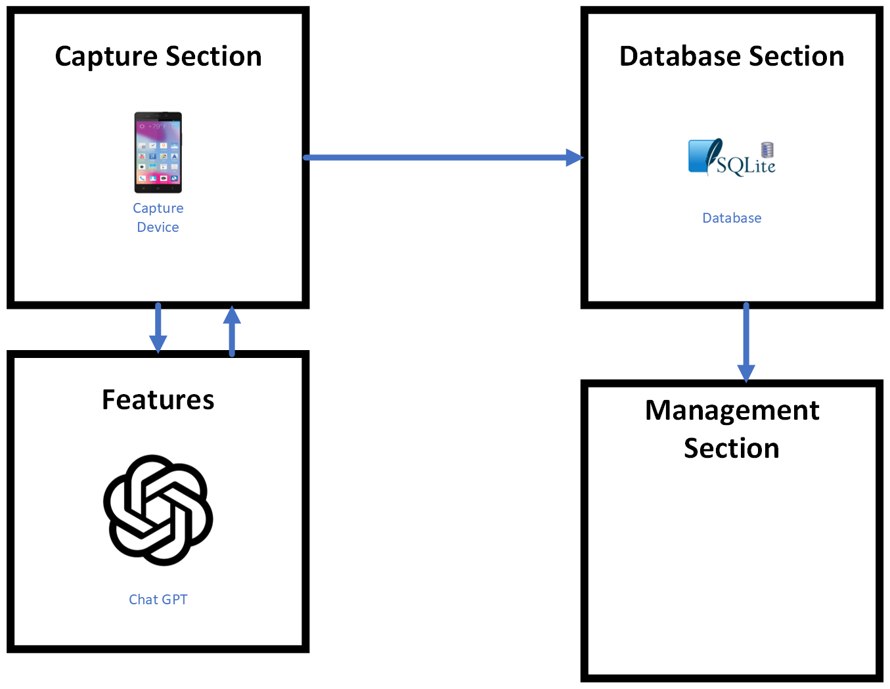

# Social Media Scheduler

The Social Media Scheduler is an application that allows users to schedule and manage their social media posts across various platforms. It integrates with the following APIs:

- Meta/Facebook API
- YouTube API
- TikTok API
- Instagram API
- Twitter API

## Diagram


## Features

- Schedule posts: Users can schedule posts to be published on their social media accounts at a specific date and time.
- Platform integration: The application seamlessly integrates with Meta/Facebook, YouTube, TikTok, Instagram, and Twitter APIs to fetch user data and publish posts.
- Database backend: The application uses SQLite as the database backend to store user information, scheduled posts, and API credentials securely.

## Installation

1. Clone the repository:

    ```bash
    git clone https://github.com/Masterjx9/socialmediascheduler.git
    ```

2. Install the required dependencies:

    ```bash
    pip install -r requirements.txt
    ```

3. Setup Ngrok (WIP):

   - Ngrok is used for instagram API as it requires a public URL to be set up. This repo comes with ngrok for windows, mac, and linux.
   - For now we recommend getting a free API key from ngrok and setting it up manually. Hopefully we will have a better solution in the future.
   - You can get a free API key from here - https://dashboard.ngrok.com/signup
   - Then go to the ngrok folder and run the following command to set up ngrok:
     ```bash
     .\ngrok config add-authtoken <YOUR_AUTH>
     ```
     or
     ```bash
     ngrok config add-authtoken <YOUR_AUTH>
     ```

4. Set up API credentials:

    - Meta/Facebook/Instagram API: 
      - You will need following:
        - **App ID (Meta_ID)** - https://business.facebook.com/latest/settings/instagram_account - Will show you the App ID for your Instagram accounts
        - **Access Token (Meta_Access_Token)** - https://developers.facebook.com/tools/explorer/ - Will show you the Access Token for your Instagram accounts
        - Make sure to link your Instagram account to your Facebook page - https://www.facebook.com/business/help/connect-instagram-to-page
    - Twitter API:
      - https://developer.twitter.com/en/docs/authentication/oauth-1-0a/api-key-and-secret
      - After creating your app in the developer portal, go to the keys link for the app which will look like this - https://developer.twitter.com/en/portal/projects/<projectid>/apps/<appid>/keys
      - You will need following:
        - **API Key (Twitter_Consumer_Key)**
        - **API Secret Key (Twitter_Consumer_Secret)**
        - **Access Token (Twitter_Access_Token)**
        - **Access Token Secret (Twitter_Access_Token_Secret)**
    - YouTube API: 
      - You will need following:
        - **API Key (YouTube_API_Key)** - https://console.developers.google.com/apis/credentials
    - LinkedIn API:
      - You will need following:
        - **Client ID (LinkedIn_Client_ID)**
        - **Client Secret (LinkedIn_Client_Secret)**
        - **Redirect URL (LinkedIn_Redirect_URL)**
      - You will need to create an app in the LinkedIn Developer portal - https://www.linkedin.com/developers/

5. Configure the application:

    - Create a `.env` file in the root directory of the project.
    - Add the following environment variables to the `.env` file:
        - Or use the sample.env to get started

      ```plaintext
      CONFIG_PATH = config.yaml
      ```

6. Run the management application:
- From python:

    ```bash
    python manage.py
    ```
- From the executable:
  - First create the executable using the following command:
    ```bash
    # Create the executable
    pyinstaller --noconfirm --onedir --windowed --icon "logo.ico" --paths "/gui"

    # Copy .env file
    cp .env output/manage/.env

    # Copy config.yaml file
    cp config.yaml output/manage/config.yaml

    # Copy database_default.sqlite3 file
    cp database_default.sqlite3 output/manage/database_default.sqlite3
    ```
  - Then run the executable from the output folder
## Usage

1. Sign in to your social media accounts within the application.
2. Create a new post and specify the date and time for it to be published.
3. The application will automatically publish the post on the scheduled date and time.

## Contributing

Contributions are welcome! If you have any ideas, suggestions, or bug reports, please open an issue or submit a pull request.

You can also read the notes.md file for more information on the project. - [notes.md](notes.md)

## License

This project is licensed under the [MIT License](LICENSE).